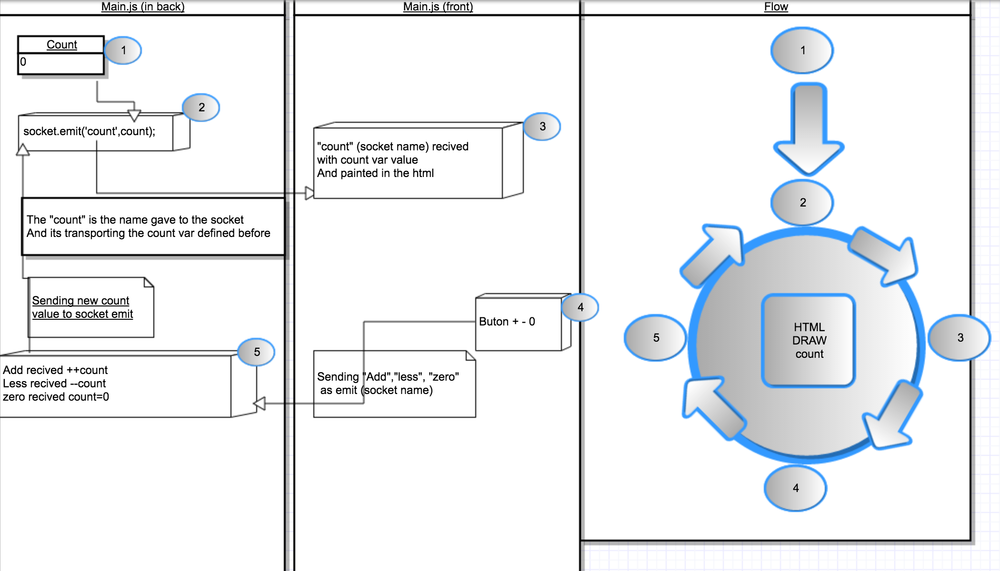

 Global Counter
===================

Easy to use counter for various people, any person can connect to your server and count people, eggs, and open source projects if you want.

### To run:
 - Just type :
   - "npm install"
 - node main (to run the server)
 - Remember to change the ip variable to your server address

### Important note:
 - If one or vairus clients go offline but has the html rendered
 the app will update the status when come back offline, you can keep
 using the + and - keys and will send to the server when back online again
 - If the server go offline, and operators keep pressing the + and - keys
 it will update too when back online.

### Made thinking on:

 - People that need to control capacity of one space with more than one access that doesn't have automatic control.
 - Put a person with this webapp in a mobile or tablet in each access and let them how many people is going in (pressing +) or how many are leaving (pressing -).
 - It has a "put to 0" the count with an alert.

### Graphical Explanation:

### Future changes
 - Alert button in case the place can be dangerous.
 - Implement a "capacity" button when approaching to that number change color, or make an alert sound (user choice).
 - Can't think in more useful functions right now.

### If have an idea

 - If you have a functionality idea please let us know opening an issue in github.
 - If you know how to implement it, please make a pull request.

### Join the project

You can join the project directly from Slack...

- [Auto-Invitation to Open Source Weekends](invitations-osweekends.herokuapp.com)

Or you can contact us directly...

- [Ulises Gascón](https://github.com/ulisesGascon)
- [Carlos Hernandez](https://github.com/codingcarlos)
- [Jose Manuel Gallego](https://github.com/Josheriff)
- [Ignacio Villanueva] (https://github.com/IgnaciodeNuevo)
